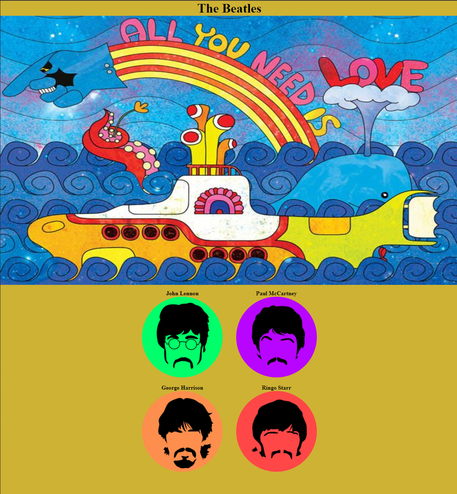

# The-Beatles

Le but de cette exercice était de manipuler les FlexBox. 
Pour ce faire j'ai fait dans mon HTML des premières div dans laquelle j'ai imbriqué les div contenant les images des membres du groupe.
Pour la partie CSS je me suis aidé de l'attribut border: 2px solid black afin de manipuler et centrer mes divs, plus facilement. 
Pour le placement des ronds de couleurs j'ai utilisé les balises flex-wrap: wrap; et justify-content: space-around afin de placer en haut John Lennon et Paul McCartney et George Harrison et Ringo Start en dessous.

Pour l'image contenant le sous marin je l'ai placé via le CSS en mettant une hauteur de 500px, définit un background-size:100% 100%; et un background-position: center center; afin que l'image soit correctement positionné. 

Pour le titre "The Beatles" j'ai utilisé la balise h2. Cette balise étant de type block j'ai utilisé l'attribut text-align: center; 

Enfin, pour placer les 4 membres du groupe au centre je les ai contenu dans la div #footer puis j'ai réaliser un display: flex et un justify-content: center; afin d'avoir le résultat voulu. 

Voici le résultat final:

